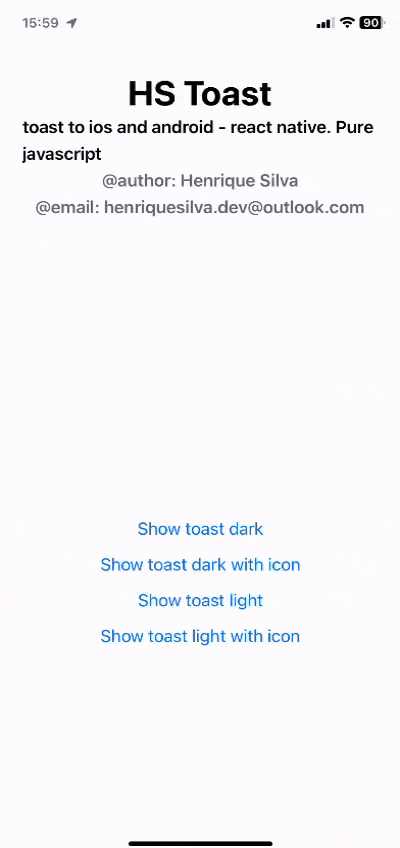

## HS TOAST
### ~Lib created to react native. It works in platform ios and android. Pure(100%) writing in javascript. 

##### Preview



> ### How to use

first install package: `yarn add hs-toast` or `npm install hs-toast`
now you need install [react-native-root-siblings](https://github.com/magicismight/react-native-root-siblings)
finally import the component RootSiblingParent in your app root and call component in higher hierarchy.


> ### exemple of use

```jsx 
// app.tsx or index.tsx
export default function App(){

    return(
        <RootSiblingParent>
        <View>
        /** contents */
        </View>
        </RootSiblingParent>
    )
}
```

```jsx 
// home.tsx // screen main
import { Button,  View, SafeAreaView } from 'react-native'
import {MaterialCommunityIcons} from '@expo/vector-icons'
import {Toast} from 'hs-toast';

export default function Main(){

    function _handleShowToast(){
        Toast.show('Toast message example!')
    }

        function _handleShowToastWithOptions(){
        Toast.show('Toast message example!', {
            duration: Toast.Duration.LONG,
            position: Toast.Position.BOTTOM,
            Icon : (props) => <MaterialCommunityIcons name='face-man' {...props} />
        })
    }

    return(
        <View>
           <Button title='show toast' onPress={_handleShowToast} />
           <Button title='show custom toast' onPress={_handleShowToastWithOptions} />
        </View>
    )
}
```

##### Optional you can the object of settings to the second params of method static show. The following properties are accept. All properties are optional.

 **Property** | **description**           | **type**             | **default**                             
:------------:|:-------------------------:|:--------------------:|:---------------------------------------:
 **duration** | Toast display time        | enum Toast.Duration  | undefined - You need call method hide() 
 **position** | Toast position in display | enum Toast.Position  | Toast.Position.BOTTOM                   
 **Icon**     | Custom icon to toast      | TypeToast.IconOption | null                                    
                                        

